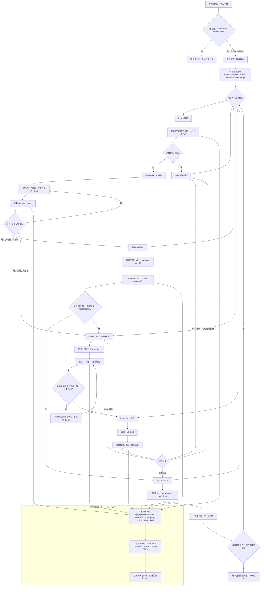

```mermaid
flowchart TD
    A["用户请求 / 当前上下文"] --> B{"是否进入 Truth Work Orchestrator"}
    B -- "否" --> B1["按普通对话 / 普通开发处理"]
    B -- "是（显式触发优先）" --> C["识别当前对象与输入"]

    C --> D["判断对象落点<br/>intake / modules / topics / work-items / knowledge"]
    D --> E{"判断当前工作模式"}

    E --> F["Intake 模式"]
    E --> G["Truth 对齐模式"]
    E --> H["陪伴开发模式"]
    E --> I["Delivery Work-item 模式"]
    E --> J["Regression 模式"]
    E --> K["记忆沉淀模式"]

    %% Intake
    F --> F1["接住原始资料 / 链接 / 文件 / 上下文"]
    F1 --> F2{"对象是否已成形"}
    F2 -- "否" --> F3["继续 intake / 补资料"]
    F2 -- "是" --> G

    %% Truth alignment
    G --> G1["收敛目标 / 范围 / 约束 / 定义 / 基线"]
    G1 --> G2["更新 current-truth.md"]
    G2 --> G3{"truth 是否足够稳定"}
    G3 -- "否" --> G1
    G3 -- "是，小范围可直接做" --> H
    G3 -- "是，需要正式承接" --> I

    %% Companion dev
    H --> H1["提炼当前 truth / knowledge 上下文"]
    H1 --> H2["直接开发（默认不创建 work-item）"]
    H2 --> H3{"是否范围外扩 / 需要恢复 / 需要独立验证"}
    H3 -- "否" --> K
    H3 -- "是" --> I

    %% Delivery work-item
    I --> I1["创建 / 推进正式 work-item"]
    I1 --> I2["规划 → 实施 → 必要验证"]
    I2 --> I3{"当前主问题是否变成一致性检查 / 回归"}
    I3 -- "否" --> I4["继续推进 / 回写状态 / 更新恢复入口"]
    I4 --> I2
    I3 -- "是" --> J

    %% Regression
    J --> J1["读取 truth 基线"]
    J1 --> J2["检查代码 / 行为 / 当前状态"]
    J2 --> J3{"回归结论"}
    J3 -- "truth 过时" --> G
    J3 -- "code 偏离" --> I
    J3 -- "暂时无法判断" --> G
    J3 -- "结论稳定" --> K

    %% Backfill
    K --> K1["回填 truth / knowledge / work-item"]
    K1 --> K2["补恢复入口 / 下一步聚焦"]
    K2 --> L{"当前对象是否已可结束或切阶段"}
    L -- "否" --> E
    L -- "是" --> M["结束当前阶段 / 进入下一对象"]

    %% Cross-cutting recording rules
    subgraph N["跨流程纪律：Recovery + 记录"]
        N1["记录触发点<br/>对象成形 / stable truth / mode 切换 / 实现或验证状态变化 / 暂停交接前"]
        N2["回写对象状态 / Truth Items / 检查结论 / 恢复入口 / 下一步聚焦"]
        N3["给用户简洁反馈：只说明记录了什么"]
    end

    F1 --> N1
    G2 --> N1
    H2 --> N1
    I2 --> N1
    J2 --> N1
    K1 --> N1
    N1 --> N2 --> N3

```
