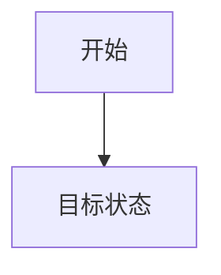
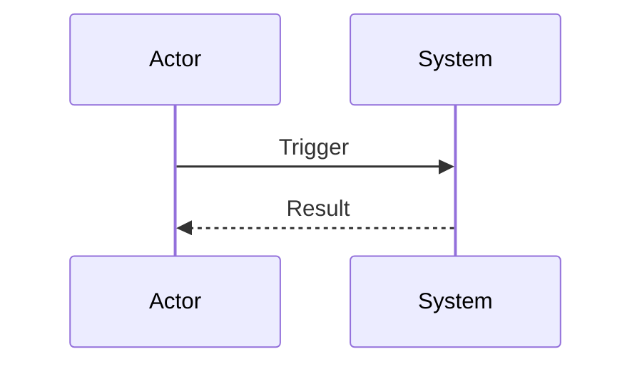
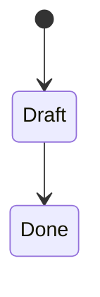
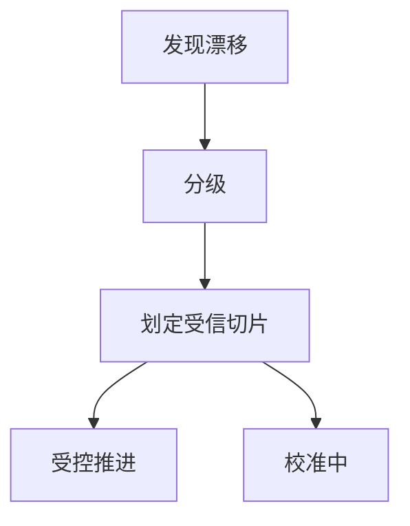

# Templates

## index/00-全局导航.md

````md
# 全局导航

## 模块入口
- <模块名>：modules/<模块名>/00-模块导航.md

## 共享真相入口
- 共享真相索引：shared-truths/00-共享真相索引.md

## 建议阅读顺序
1. shared-truths/00-共享真相索引.md
2. modules/<模块名>/00-模块导航.md
````

## shared-truths/00-共享真相索引.md

````md
# 共享真相索引

## Protocols
- 

## Domain
- 

## UI-UX
- 

## Engineering
- 
````

## modules/<模块名>/00-模块导航.md

````md
# <模块名> 模块导航

## 当前真相入口
- 当前能力地图：facts/10-当前能力地图.md

## 事实区入口
- 事实索引：facts/00-事实索引.md
- Protocols：facts/protocols/
- Domain：facts/domain/
- UI-UX：facts/ui-ux/
- References：facts/references/

## 活跃意图入口
- intents/active/

## 已沉淀意图入口
- intents/settled/00-沉淀索引.md

## 共享真相入口
- ../../shared-truths/00-共享真相索引.md

## 已知漂移 / 校准入口
- 若存在漂移，优先查看相关意图中的漂移校准结果或事实文档状态

## 建议阅读顺序
1. facts/10-当前能力地图.md
2. facts/00-事实索引.md
3. intents/active/
4. intents/settled/00-沉淀索引.md
````

## facts/00-事实索引.md

````md
# <模块名> 事实索引

## Protocols
- 

## Domain
- 

## UI-UX
- 

## References
- 

## 当前状态异常 / 漂移入口
- 
````

## facts/10-当前能力地图.md

````md
# <模块名> 当前能力地图

## 当前能力
- 能力 A：
  - 状态：已确认 / 观察稳定 / 待更新 / 存在漂移 / 仅临时可用
  - 当前说明：
  - 关联事实：
  - 来源沉淀：
  - 当前受信范围：
- 能力 B：
  - 状态：已确认 / 观察稳定 / 待更新 / 存在漂移 / 仅临时可用
  - 当前说明：
  - 关联事实：
  - 来源沉淀：
  - 当前受信范围：

## 当前建议阅读入口
- 

## 当前边界 / 例外 / 待补事实
- 

## 已知漂移
- 漂移项：
  - 等级：D0 / D1 / D2 / D3
  - 影响范围：
  - 当前处理方式：
````

## intents/active/<意图ID>-<意图名>/00-意图总览.md

````md
# <意图ID>-<意图名> 意图总览

## 基本信息
- 模块：
- 状态：构思中 / 事实已立 / 意图已定 / 落地中 / 验证中 / 校准中 / 带漂移推进 / 已沉淀

## 为什么做

## 范围

## 非范围

## 目标状态

## 验收口径

## 已知漂移
- 

## 当前受信切片
- 

## 待确认项
- 
````

## intents/active/<意图ID>-<意图名>/10-事实基础.md

````md
# <意图ID>-<意图名> 事实基础

## 当前事实真相摘要
- 

## 依赖事实文档
- facts/protocols/
- facts/domain/
- facts/ui-ux/
- facts/references/

## 关键约束
- 

## 假设
- 假设：
  - 影响范围：
  - 失效条件：
  - 回收时点：

## 已知漂移
- 漂移项：
  - 类型：事实真相 / 当前真相 / 意图真相 / 行为语义
  - 等级：D0 / D1 / D2 / D3
  - 影响范围：

## 当前受信切片
- 

## 待补充事实
- 
````

## intents/active/<意图ID>-<意图名>/20-意图图谱.md

````md
# <意图ID>-<意图名> 意图图谱

## 图谱说明
- 本文档用于通过 Mermaid 和补充说明表达目标结构、流程、状态与关系。
- 若当前存在漂移，可同时表达稳定主路径与校准分支。

## 目标结构图


## 关键时序图


## 关键状态图


## 漂移与校准分支图（可选）


## 图谱解读
- 
````

## intents/active/<意图ID>-<意图名>/30-行为语义.md

````md
# <意图ID>-<意图名> 行为语义

## 行为总览
- 

## 关键行为拆解

### 01 <行为标题>
- 对应意图：
- 工作方式：
- 协议 / 字段：
- 状态 / 流转：
- 依赖事实：
- 边界与异常：
- 当前状态：稳定 / 存在漂移 / 仅临时可用
- 当前受信范围：

### 02 <行为标题>
- 对应意图：
- 工作方式：
- 协议 / 字段：
- 状态 / 流转：
- 依赖事实：
- 边界与异常：
- 当前状态：稳定 / 存在漂移 / 仅临时可用
- 当前受信范围：

## 已知漂移与例外
- 
````

## intents/active/<意图ID>-<意图名>/40-工程落地.md

````md
# <意图ID>-<意图名> 工程落地

## 工程边界与影响面

## 事实约束
- 

## 实施原则
- 最少返工：
- 依赖最顺：
- 分阶段验证：
- 优先在受信切片内推进：

## 建议实施路径
1. 
2. 
3. 

## 模块 / 文件影响
- 

## 带漂移推进约束
- 当前受信切片：
- 当前不受信区域：
- 临时假设：
- 暂停项：

## 风险与回退
- 
````

## intents/active/<意图ID>-<意图名>/50-验证与回归.md

````md
# <意图ID>-<意图名> 验证与回归

## 验证项
- [ ] 意图点 01：
  - 对应行为：
  - 对应事实约束：
  - 验证方式：
  - 验证状态：待验证 / 通过 / 不通过 / 因漂移暂缓
- [ ] 意图点 02：
  - 对应行为：
  - 对应事实约束：
  - 验证方式：
  - 验证状态：待验证 / 通过 / 不通过 / 因漂移暂缓
- [ ] 边界与异常验证
- [ ] 协议与兼容验证

## 假设验证
- 假设：
  - 结果：已证实 / 已证伪 / 延后确认
  - 影响：

## 漂移回收
- 漂移项：
  - 当前结果：已消除 / 仍存在 / 转入待更新
  - 对验证结论的影响：

## 回归记录
- 结论：通过 / 不通过 / 部分通过
- 记录人：
- 时间：
````

## intents/active/<意图ID>-<意图名>/60-漂移校准.md

````md
# <意图ID>-<意图名> 漂移校准结果

## 1. 观察到的漂移
- 漂移项：
- 发现时间：
- 事实来源：

## 2. 漂移等级与类型
- 等级：D0 / D1 / D2 / D3
- 类型：事实真相 / 当前真相 / 意图真相 / 行为语义 / 实现偏离

## 3. 影响范围
- 影响模块：
- 影响行为：
- 影响验证项：

## 4. 当前受信切片
- 

## 5. 临时假设与限制
- 假设：
- 限制：
- 失效条件：

## 6. 处理路径
- 修文档 / 修实现 / 临时并存 / 拆分意图
- 选择原因：

## 7. 下一步校准动作
1. 
2. 
3. 
````

## intents/active/<意图ID>-<意图名>/61-带漂移推进.md

````md
# <意图ID>-<意图名> 带漂移推进说明

## 当前推进前提
- 漂移已显式记录：是 / 否
- 受信切片已明确：是 / 否
- 临时假设已写出：是 / 否
- 下一步校准动作已指定：是 / 否

## 当前允许推进的内容
- 

## 当前禁止误判为稳定完成的内容
- 

## 本轮交付边界
- 

## 回收条件
- 进入验证前需完成：
- 进入沉淀前需完成：
````

## intents/settled/00-沉淀索引.md

````md
# <模块名> 沉淀索引

## 已沉淀意图
- <意图ID>-<意图名>.md
- <意图ID>-<意图名>.md
````

## intents/settled/<意图ID>-<意图名>.md

````md
# <模块名> <意图ID>-<意图名> 沉淀结果

## 1. 新确认的事实真相
- 文档：
- 内容：

## 2. 已兑现的意图真相
- 意图点：
- 结果说明：

## 3. 假设验证结果
- 假设：
- 结果：已证实 / 已证伪 / 延后确认
- 影响：

## 4. 漂移处理结果
- 漂移项：
- 结果：已消除 / 保留 / 转入待更新
- 后续处理：

## 5. 当前真相更新
- 能力项：
- 状态：已确认 / 观察稳定 / 待更新 / 存在漂移 / 仅临时可用
- 当前说明：
- 关联入口：

## 6. 共享真相晋升
- 候选内容：
- 晋升原因：
- 目标位置：

## 7. 原活跃意图目录处理
- 原路径：modules/<模块名>/intents/active/<意图ID>-<意图名>/
- 处理结果：已移除 / 保留校准记录 / 转存附件
````
